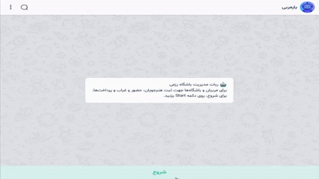

# 🤖 یار مربی (Coach Assistant Bot)

یار مربی یک ربات تلگرام یا یک بازو در بله برای مدیریت باشگاه‌های ورزشی است که به مربیان کمک می‌کند:

- 🧍 ثبت و مدیریت هنرجویان
- 📆 مدیریت کلاس‌ها
- ✔️ حضور و غیاب کلاس‌ها
- 💳 ثبت پرداخت شهریه و خرید تجهیزات
- 📊 دریافت گزارش‌ها

---

## 🚀 ویژگی‌ها

| قابلیت               | وضعیت |
| -------------------- | ----- |
| ثبت هنرجو            | ✔     |
| ثبت کلاس             | ✔     |
| حضور و غیاب          | ✔     |
| مدیریت پرداخت‌ها     | ✔     |
| گزارش‌دهی            | ✔     |
| ویرایش و حذف اطلاعات | ✔     |

---

## 🎥 دموی ربات

<p align="center">
  
</p>

---

## 🛠️ تکنولوژی‌ها

- Node.js
- Telegraf.js
- Sequelize ORM
- MySQL

---

## 📦 نصب و اجرا

```sh
git clone https://github.com/mohammadjavad-gorgani/coach-bot.git
cd coach-bot
npm install
cp .env.example .env
npm start
```
